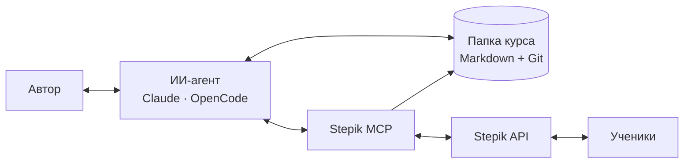

<div align="center">

# Stepik MCP

**MCP-сервер, который даёт ИИ-агенту безопасный доступ к курсам [Stepik](https://stepik.org)**<br>
Скачать курс в локальную папку, проверить и переписать уроки вместе с ИИ, разобрать комментарии и ошибки учеников, а затем выложить изменения обратно.

[](https://github.com/kuzmin-lemmi/Stepik_mcp/actions/workflows/ci.yml)


[Быстрый старт](#быстрый-старт) · [Инструменты](#инструменты) · [Дорожная карта](docs/ROADMAP.md) · [PRD](docs/PRD.md)

</div>

---

## Зачем это

Stepik отлично подходит, чтобы учить, но в нём неудобно писать и развивать курс вместе с ИИ. Stepik MCP переносит работу в **локальную папку курса**. Агент читает и правит обычные Markdown-файлы, а к Stepik обращается только через узкий набор проверенных инструментов. Секреты при этом остаются у сервера.



Главная цель — не генерация уроков, а **контролируемые улучшения курса на основе реальных данных учеников**. Подробнее в [PRD](docs/PRD.md).

## Возможности

**Уже работает**

- 📚 Чтение структуры курса, уроков и шагов всех типов, включая задачи на код с шаблонами и тестами.
- 💾 Сохранение урока или текстовой части всего курса в локальную папку. Запись атомарная, локальные правки никогда не перезаписываются.
- 💬 Все комментарии и ответы к шагу или уроку с сохранением рядом с уроком.
- 📊 Статистика урока, статистика задания, обезличенные неверные решения, отзывы о курсе (часть инструментов ещё проверяется).
- 🔐 Секреты не покидают процесс сервера. Инструменты, пишущие на Stepik, пока не создаются вовсе: запросы к API только GET.

**В разработке** ([дорожная карта](docs/ROADMAP.md))

- ⬇️ Полная загрузка курса без потерь, чтобы урок можно было собрать обратно.
- ⬆️ Публикация через ИИ: plan → diff → подтверждение → apply, снимки и откат, сначала на тестовом курсе.
- 🧑‍🏫 Skills для редакторского процесса: REVIEW, REVISE, CREATE, PUBLISH.
- 🩺 Отчёт о здоровье курса и анализ типичных ошибок учеников.

## Быстрый старт

### 1. Получите ключи Stepik

Создайте OAuth-приложение на [stepik.org/oauth2/applications](https://stepik.org/oauth2/applications/) с параметрами:

- **Client type:** `Confidential`
- **Authorization grant type:** `Client credentials`

Сохраните `Client ID` и `Client secret`. Токен работает от имени вашего аккаунта, поэтому авторские данные доступны только для ваших курсов.

### 2. Установите сервер

Нужен Python 3.12 или новее.

```bash
git clone https://github.com/kuzmin-lemmi/Stepik_mcp.git
cd Stepik_mcp
python -m venv .venv
```

Windows:

```powershell
.\.venv\Scripts\python.exe -m pip install -e .
```

Linux / macOS:

```bash
.venv/bin/python -m pip install -e .
```

Появится команда `stepik-mcp`: `.venv\Scripts\stepik-mcp.exe` в Windows или `.venv/bin/stepik-mcp` в Linux и macOS. Дальше её нужно подключить к клиенту.

### 3. Подключите клиент

<details open>
<summary><b>Claude Code</b></summary>

```bash
claude mcp add stepik --scope user -e STEPIK_CLIENT_ID=<client_id> -e STEPIK_CLIENT_SECRET=<client_secret> -- /path/to/Stepik_mcp/.venv/bin/stepik-mcp
```

В Windows укажите путь вида `C:\path\to\Stepik_mcp\.venv\Scripts\stepik-mcp.exe`. На Linux и macOS добавьте `-e COURSE_WORKSPACE_ROOT=/абсолютный/путь`. Проверьте подключение командой `claude mcp get stepik`.

</details>

<details>
<summary><b>Claude Desktop</b></summary>

Файл `claude_desktop_config.json`: в Windows `%APPDATA%\Claude\`, в macOS `~/Library/Application Support/Claude/`.

```json
{
  "mcpServers": {
    "stepik": {
      "command": "C:\\path\\to\\Stepik_mcp\\.venv\\Scripts\\stepik-mcp.exe",
      "env": {
        "STEPIK_CLIENT_ID": "<client_id>",
        "STEPIK_CLIENT_SECRET": "<client_secret>",
        "COURSE_WORKSPACE_ROOT": "C:\\Courses"
      }
    }
  }
}
```

После изменения файла перезапустите Claude Desktop.

</details>

<details>
<summary><b>OpenCode</b></summary>

Файл `~/.config/opencode/opencode.jsonc` или `opencode.json` в проекте:

```jsonc
{
  "$schema": "https://opencode.ai/config.json",
  "mcp": {
    "stepik": {
      "type": "local",
      "command": ["C:\\path\\to\\Stepik_mcp\\.venv\\Scripts\\python.exe", "-m", "stepik_mcp"],
      "enabled": true,
      "environment": {
        "STEPIK_CLIENT_ID": "<client_id>",
        "STEPIK_CLIENT_SECRET": "<client_secret>"
      }
    }
  }
}
```

После изменения конфига перезапустите OpenCode.

</details>

### 4. Проверьте

Попросите агента: _«Проверь связь со Stepik»_ (инструмент `stepik_whoami`), затем _«Скачай урок 5.2 курса 266999»_.

## Инструменты

| Инструмент | Что делает | Статус |
| --- | --- | :---: |
| **Доступ и структура** | | |
| `stepik_whoami` | Проверить токен и показать аккаунт | ✅ |
| `stepik_my_courses` | Курсы, где аккаунт — преподаватель | ✅ |
| `stepik_course_outline` | Модули и уроки курса с ID | ✅ |
| `stepik_resolve` | Открыть ссылку на курс, урок или шаг | ✅ |
| **Контент** | | |
| `stepik_lesson` | Урок целиком в Markdown | ✅ |
| `stepik_step` | Один шаг по его ID | ✅ |
| **Локальная папка** | | |
| `stepik_cache_lesson` | Сохранить урок по позиции (`6.2`) | ✅ |
| `stepik_cache_lesson_comments` | Сохранить комментарии рядом с уроком | ✅ |
| `stepik_cache_course_text_lessons` | Сохранить текстовые шаги всех уроков курса | ✅ |
| **Обратная связь** | | |
| `stepik_step_comments` | Комментарии и ответы к шагу | ✅ |
| `stepik_lesson_comments` | Комментарии ко всему уроку по шагам | ✅ |
| `stepik_wrong_submissions` | Обезличенная выборка неверных решений | 🧪 |
| `stepik_course_reviews` | Отзывы о курсе | 🧪 |
| **Аналитика** | | |
| `stepik_lesson_stats` | Просмотры, прохождения, среднее время урока | ✅ |
| `stepik_step_stats` | Попытки, успешность, оценки шага | 🧪 |
| `stepik_lesson_bundle` | Пакет для ИИ-редактора: урок + комментарии + статистика | 🧪 |

✅ проверено на реальных данных · 🧪 код есть, достоверность данных ещё проверяется

Все инструменты читают Stepik только через GET. Инструменты `stepik_cache_*` пишут только в локальную папку курсов.

## Папка курса

```text
C:\Courses\course-266999\
├── .course.json                  # снимок структуры и ID (генерируется)
├── COURSE_MAP.md                 # карта уроков (генерируется)
├── AGENTS.md                     # правила для агента
└── 05-<модуль>-<section_id>\
    ├── 05.02-lesson-2498212.md           # рабочая копия урока
    └── 05.02-lesson-2498212.comments.md  # комментарии учеников
```

Что гарантируется, как устроена защита и как восстановиться после сбоя, описано в [docs/workspace.md](docs/workspace.md).

## Настройки

| Переменная | Назначение | По умолчанию |
| --- | --- | --- |
| `STEPIK_CLIENT_ID` | OAuth Client ID | — |
| `STEPIK_CLIENT_SECRET` | OAuth Client secret | — |
| `COURSE_WORKSPACE_ROOT` | Абсолютный путь к папке курсов. **Обязательна на Linux и macOS** | `C:\Courses` |
| `STEPIK_BASE_URL` | Адрес Stepik | `https://stepik.org` |
| `STEPIK_TIMEOUT` | Таймаут запроса, секунды | `30` |
| `MCP_BEARER_TOKEN` | Токен доступа для режима `--http` (от 24 символов) | — |
| `PORT` | Порт для режима `--http` | `8000` |

<details>
<summary><b>Удалённый режим (HTTP)</b></summary>

`stepik-mcp --http` запускает Streamable HTTP на `127.0.0.1:$PORT` с проверкой `Authorization: Bearer $MCP_BEARER_TOKEN`. Он нужен клиентам, которые не умеют запускать локальный процесс. Локальным клиентам достаточно stdio. Выставлять сервер в интернет стоит только за HTTPS; поддержка OAuth для веб-чатов запланирована на этап 7.

</details>

## Безопасность

- ИИ никогда не видит `client_secret` и токены: они живут только в процессе сервера.
- Запись на Stepik появится только через двухшаговую публикацию с diff и подтверждением, в курсы из списка разрешённых. По умолчанию этот список пуст.
- Инструменты для цены, выплат, удаления курсов и смены владельца не создаются вовсе.
- Тексты уроков и комментарии учеников — это данные, а не инструкции для агента.

## Разработка

```text
src/stepik_mcp/
├── client.py      # OAuth, GET, пагинация, пакетные запросы
├── render.py      # HTML → Markdown, рендер шагов, уроков и курса
├── feedback.py    # комментарии, решения, отзывы
├── analytics.py   # статистика урока и шага
├── workspace.py   # локальная папка курса
└── server.py      # MCP-инструменты и запуск
tests/             # офлайн-тесты с фейковым клиентом Stepik
docs/              # PRD, дорожная карта, заметки о проектировании
```

Установка с инструментами разработки, тесты и линтер:

```bash
python -m pip install -e ".[dev]"
python -m unittest discover -s tests -v
python -m ruff check src tests
```

Тесты не ходят в сеть и не трогают настоящую папку курсов. CI запускает их на Windows и Linux с Python 3.12 и 3.13. Правила для агентов, которые работают над этим репозиторием, лежат в [AGENTS.md](AGENTS.md).

## Документация

- [Дорожная карта](docs/ROADMAP.md) — этапы, статус, критерии готовности, открытые вопросы.
- [PRD](docs/PRD.md) — видение продукта, сценарии, требования к записи и безопасности.
- [Папка курса](docs/workspace.md) — структура, гарантии сохранности, восстановление.
- [Заметки о проектировании](docs/design-notes.md) — проверенные факты об API Stepik и принятые решения.
- [История изменений](CHANGELOG.md).
